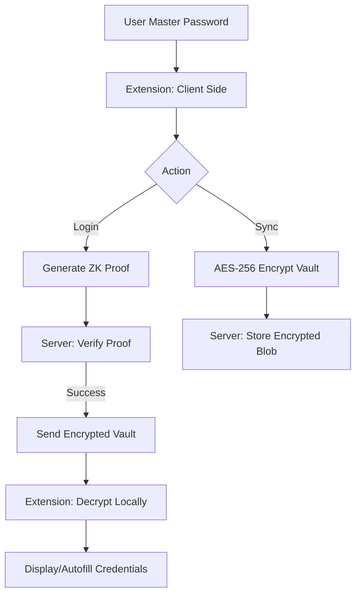

# System Architecture 🏗️

This document describes the high-level design of the **BlindVault** password manager.

## Overview
BlindVault is designed as a **privacy-first** application where the server never learns the user's master password. This is achieved through a combination of **Zero-Knowledge Proofs (ZKP)** and **AES-GCM encryption**.

## System Components

### 1. Chrome Extension (Client)
- **UI:** Built with HTML/CSS/Vanilla JS (Manifest V3).
- **ZKP Module:** Generates cryptographic proofs using `snarkjs` and the `auth.circom` circuit.
- **Crypto Module:** Handles key derivation (PBKDF2) and data encryption/decryption (AES-GCM) via the Web Crypto API.
- **Content Scripts:** Injects autofill logic, background password harvesting, and secure Shadow DOM prompts directly into third-party websites. It communicates with the background worker to ensure UI state sync.
- **Background Worker:** A Manifest V3 Service Worker that manages ephemeral state (`chrome.storage.session`), handles encryption for new passwords harvested in the background, and verifies Quick Unlock requests locally to prevent unnecessary server trips.
### 2. Backend Server (Modular Monolith)
- **Runtime:** Node.js + Express.
- **Database:** MongoDB (using Mongoose).
- **Responsibilities:**
  - Verifying ZKP proofs during authentication.
  - Storing and serving encrypted vault "blobs".
  - Basic user profile management.

## Data Flow Diagram

## Key Design Principles
1. **Blind Server:** The database only stores encrypted data and public verification parameters.
2. **Deterministic Keys:** The encryption key is derived directly from the master password (not stored anywhere).
3. **Local-Only Passwords:** The master password never crosses the network.
